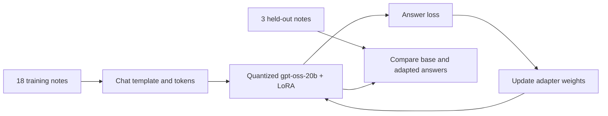

# Fine-tune gpt-oss-20b on an Apple Silicon Mac with MLX-LM

This is a **manual, hands-on learning lab**. Clone the repository, read each step, run the command yourself, and inspect its output before continuing. The included JSONL data and Python inspection scripts are ready to use; you do **not** need to write Python code. The actual training is performed by MLX-LM's command-line tool.

The exercise teaches a quantized MLX copy of `gpt-oss-20b` to classify a short note and emit a private route code: `WORK R31`, `PERSONAL R58`, or `SHOPPING R74`. On the recorded Mac, the final LoRA adapter answered **3 of 3 held-out notes exactly**. Earlier attempts failed, and [the experiment journal](docs/experiments.md) includes those attempts and what we learned. Three test notes are a teaching example, not a broad measure of model quality.

The base model and adapters are **not** in this Git repository. You download the model and train your own local adapter by following the steps below. The model is [hosted on Hugging Face](https://huggingface.co/mlx-community/gpt-oss-20b-MXFP4-Q8); its weights have their own Apache 2.0 license. The tutorial source files in this repository are MIT licensed.

If you are new to fine-tuning, the preceding [small-model Transformers + TRL exercise](https://github.com/ssganiger/mac-llm-finetuning-lab) introduces the same concepts on a faster 0.5B model. This repository is the standalone MLX follow-up.

## What you will learn

1. Separate a **base model**, **training examples**, **test examples**, and a **LoRA adapter**.
2. See how a chat template and tokenizer turn text into tokens.
3. Record what the unchanged model does before training.
4. Train a small set of adapter weights on a quantized 20B model with MLX-LM.
5. Load the adapter and check exact answers on notes withheld from training.
6. Read failed runs honestly: low training loss can coexist with wrong generated answers.



[Detailed Mermaid diagrams](docs/architecture.md) show the full v3 training loop, the sequence of failed and successful attempts, and the Mac's software and memory layout.

## Mac and disk requirements

| Item | Requirement or practical target | Recorded run |
| --- | --- | --- |
| Computer | **Apple Silicon Mac**. It need not be a Mac Pro; a MacBook Pro can work. Intel Macs are outside this tutorial. | MacBook Pro with M3 Pro |
| macOS | **14.0 or newer** for MLX's published macOS installation requirement. | macOS 26.6.2 |
| Python | Native ARM Python **3.11** for the pinned package set. MLX generally supports Python 3.10+, but this exact run used 3.11. | Python 3.11.7 |
| Unified memory | **36 GB is the smallest capacity verified in this lab**. Lower capacities have not been tested for this 16-layer training run; do not treat the 12.6 GB inference peak as the training requirement. | 36 GB |
| Free storage | **25 GiB suggested before starting**, leaving room for the 12.1 GB model, packages, download cache, and adapter checkpoints. This is a planning allowance, not a measured minimum. | 116 GiB free before download |
| Network | Needed for Python packages and the one-time model download. | Public, unauthenticated Hugging Face download worked |

Check your Mac with **About This Mac** for chip and memory. In Terminal, `uname -m` should print `arm64`; `df -h .` shows free space. [MLX installation requirements](https://github.com/ml-explore/mlx/blob/main/docs/src/install.rst) and the [model card](https://huggingface.co/mlx-community/gpt-oss-20b-MXFP4-Q8) are the primary references. The model card lists a 12.1 GB MLX download. We have not measured a true minimum memory or disk configuration for training.

## Tools used

| Tool | Version in recorded run | Role |
| --- | --- | --- |
| Git and GitHub | Local version may vary | Clone the small source/data repository. |
| Python and `venv` | 3.11.7 | Isolate this exercise from other Python projects and run the included inspection scripts. |
| `pip` | Local version may vary | Install packages from `requirements.txt` inside `.venv`. |
| Hugging Face Hub CLI (`hf`) | `huggingface-hub` 1.33.0 | Download the model and tokenizer to `models/`. |
| `mlx-community/gpt-oss-20b-MXFP4-Q8` | Model snapshot may change over time | Quantized, MLX-compatible copy of `openai/gpt-oss-20b`. |
| MLX | 0.32.3 | Array and compute framework for Apple Silicon. |
| MLX-LM | 0.32.0 | Run local generation and LoRA training. |
| Transformers | 5.19.0 | Inspect the local tokenizer and chat template; MLX-LM also uses tokenization support. |

Versions are pinned in [`requirements.txt`](requirements.txt) for a close reproduction of the recorded run. The local `gpt-oss:20b` copy that some readers may have in **Ollama** is separate; these commands use the downloaded **MLX** copy.

## Repository contents

| Path | Purpose |
| --- | --- |
| [`data/routes_v1/`](data/routes_v1) | First route-only dataset, included so failed results can be reproduced. |
| [`data/routes_v2/`](data/routes_v2) | Two-line category-and-route dataset used in the second failed design. |
| [`data/routes_v3/`](data/routes_v3) | Final compact dataset used for the successful recorded run. |
| [`scripts/inspect_data.py`](scripts/inspect_data.py) | Checks record counts, class balance, and train/test note separation. |
| [`scripts/inspect_tokens.py`](scripts/inspect_tokens.py) | Shows the final dataset's chat-token boundary and answer tokens. |
| [`scripts/prompt.py`](scripts/prompt.py) | Prints an **exact** prompt from a data file for use with `mlx_lm.generate`. |
| [`docs/experiments.md`](docs/experiments.md) | Settings and observed outcomes for all major attempts. |
| [`docs/concepts.md`](docs/concepts.md) | Short explanations of the terms used here. |

Generated `.venv/`, `models/`, `outputs/`, and model/adapter weight files are ignored by Git. The public repository contains six small JSONL files, three short scripts, and documentation; it does not contain the 12.1 GB model or 282 MB adapter weights.

## Follow the successful exercise step by step

Run each step in **Terminal on your own Mac**, from the repository root unless stated otherwise. The commands are shown separately so you can inspect what happened before moving on. The Python files are already in the repository; you only run them.

### 1. Clone the code and inspect the folder

```bash
git clone https://github.com/ssganiger/mac-gpt-oss-mlx-finetuning-lab.git
cd mac-gpt-oss-mlx-finetuning-lab
ls
```

**Why:** `git clone` copies the small examples and guide. `cd` makes that copy your working directory. `ls` lets you confirm the expected files are present. No model download or training happens here.

### 2. Check the Mac and create an isolated Python environment

```bash
uname -m
python3.11 --version
df -h .
python3.11 -m venv .venv
source .venv/bin/activate
python --version
```

**Why:** The first three commands check Apple Silicon, Python, and disk space before a large download. `venv` creates a project-local Python environment; `source` selects it for this Terminal session. The last command should show Python 3.11.x. If `python3.11` is missing, install a native ARM Python 3.11 from [python.org](https://www.python.org/downloads/) and rerun the check. Activating `.venv` does not delete or replace other Python installations.

### 3. Install the recorded software versions

```bash
python -m pip install -r requirements.txt
python -c 'from importlib.metadata import version; print("MLX:", version("mlx")); print("MLX-LM:", version("mlx-lm")); print("Transformers:", version("transformers"))'
```

**Why:** `python -m pip` installs into the active `.venv`; the second command reads installed package versions. It does not load the model. Expected versions are MLX 0.32.3, MLX-LM 0.32.0, and Transformers 5.19.0. [MLX-LM's training guide](https://github.com/ml-explore/mlx-lm/blob/main/mlx_lm/LORA.md) documents the training extra and CLI options.

### 4. Download the MLX model

```bash
hf download mlx-community/gpt-oss-20b-MXFP4-Q8 --local-dir models/gpt-oss-20b-mlx
```

**Why:** This retrieves model weights, configuration, and tokenizer from Hugging Face into the path used below. The recorded download reconstructed about **12.1 GB**. It can take several minutes; a warning about unauthenticated requests is not by itself a failure. This is the **unchanged base model**, not a trained adapter. The download stays local and `models/` is ignored by Git.

### 5. Inspect the examples and their separation

```bash
python scripts/inspect_data.py
```

**Why:** This read-only script checks each dataset version. You should see **18 training** and **3 test** records per version, six training records per category, one test record per category, and **no overlapping note text** between train and test. A JSONL line is one conversation: a `user` message asking the task, then an `assistant` message containing the target answer. MLX-LM's [chat-data format](https://github.com/ml-explore/mlx-lm/blob/main/mlx_lm/LORA.md#data) accepts this structure. The v3 mapping is WORK → R31, PERSONAL → R58, SHOPPING → R74.

### 6. Watch chat formatting and tokenization

```bash
python scripts/inspect_tokens.py
```

**Why:** The script loads only the local tokenizer, not the 20B weights. It shows how the chat template wraps each conversation and where the answer begins. For all three categories, `prompt matches complete-example prefix` should be `True`. In the recorded v3 run, complete examples were **110–112 tokens**, well below the 256-token training limit. Both category tokens and route-code tokens differ among answers. `--mask-prompt` in the training command will use this boundary to train on the assistant answer.

### 7. Record the base model's answer before training

First inspect the exact held-out personal question:

```bash
python scripts/prompt.py --version routes_v3 --split test --index 2
```

Then ask the unchanged model:

```bash
mlx_lm.generate \
  --model models/gpt-oss-20b-mlx \
  --prompt "$(python scripts/prompt.py --version routes_v3 --split test --index 2)" \
  --max-tokens 256 \
  --temp 0
```

**Why:** Index 2 is the held-out `Call Mom on Sunday.` note. The helper copies its prompt **exactly**, including a real newline before `Note:`. This avoids a common Bash mistake: `'\n'` in ordinary single quotes is a literal backslash and `n`, not a newline. There is no `--adapter-path`, so this is the base model. In our run it recognized PERSONAL in its analysis but did not know the private route code and reached the 256-token limit without a final answer. The target is `PERSONAL R58`. `--temp 0` makes generation deterministic for this comparison.

### 8. Train a fresh LoRA adapter on v3

```bash
mlx_lm.lora \
  --model models/gpt-oss-20b-mlx \
  --train \
  --data data/routes_v3 \
  --adapter-path outputs/gpt-oss-routes-v3-16layer \
  --fine-tune-type lora \
  --num-layers 16 \
  --batch-size 1 \
  --iters 120 \
  --max-seq-length 256 \
  --learning-rate 1e-5 \
  --mask-prompt \
  --grad-checkpoint \
  --steps-per-report 20
```

**Why:** MLX-LM reads `data/routes_v3/train.jsonl`, applies the model's chat template, predicts answer tokens, measures loss, and adjusts LoRA adapter weights. The quantized base weights stay frozen. `outputs/gpt-oss-routes-v3-16layer` receives the adapter; nothing is uploaded. The `test.jsonl` notes are **not** used for weight updates.

| Option | Meaning in this run |
| --- | --- |
| `--num-layers 16` | Put rank-8 LoRA adapters in 16 layers; rank 8 is MLX-LM's default in the recorded version. |
| `--batch-size 1` | One training example per weight update. |
| `--iters 120` | 120 updates, about 6⅔ passes through 18 examples. |
| `--max-seq-length 256` | Enough room for every inspected example. |
| `--learning-rate 1e-5` | Size of each optimizer update; ten times smaller than earlier failed runs. |
| `--mask-prompt` | Compute loss on the desired assistant answer rather than the user question. |
| `--grad-checkpoint` | Trade extra computation for lower training memory use. |
| `--steps-per-report 20` | Print training loss every 20 updates. |

Watch for `120/120`, a saved adapter, and no error. The recorded run had **73.806 million trainable parameters**, about **0.353%** of 20.915 billion model parameters; loss at step 120 was **0.001**. Training loss measures fit to training batches, not test quality. A warning that the optional `valid.jsonl` is missing is expected; the three `test.jsonl` examples remain held out.

### 9. Inspect the saved adapter

```bash
ls -lh outputs/gpt-oss-routes-v3-16layer
```

**Why:** You should see `adapter_config.json` and `adapters.safetensors`. The recorded final adapter was about **282 MB**. It contains learned adjustments, not a full standalone 20B model; generation still needs `models/gpt-oss-20b-mlx`. MLX-LM may also save a numbered checkpoint at iteration 100.

### 10. Test a note that appeared during training

```bash
mlx_lm.generate \
  --model models/gpt-oss-20b-mlx \
  --adapter-path outputs/gpt-oss-routes-v3-16layer \
  --prompt "$(python scripts/prompt.py --version routes_v3 --split train --index 9)" \
  --max-tokens 256 \
  --temp 0
```

**Why:** Index 9 is `Call my friend Ravi tonight.` and its stored answer is `PERSONAL R58`. This is a **seen-example check**: the adapter should follow the target format on a training note. A correct seen answer is useful but does not establish generalization; the next step uses held-out notes.

### 11. Test all three held-out notes, one at a time

The indices in `data/routes_v3/test.jsonl` are **0 shopping**, **1 work**, and **2 personal**. Run each command and compare the text inside `<|channel|>final` with the expected answer in the table.

```bash
mlx_lm.generate --model models/gpt-oss-20b-mlx --adapter-path outputs/gpt-oss-routes-v3-16layer --prompt "$(python scripts/prompt.py --version routes_v3 --split test --index 0)" --max-tokens 256 --temp 0
```

```bash
mlx_lm.generate --model models/gpt-oss-20b-mlx --adapter-path outputs/gpt-oss-routes-v3-16layer --prompt "$(python scripts/prompt.py --version routes_v3 --split test --index 1)" --max-tokens 256 --temp 0
```

```bash
mlx_lm.generate --model models/gpt-oss-20b-mlx --adapter-path outputs/gpt-oss-routes-v3-16layer --prompt "$(python scripts/prompt.py --version routes_v3 --split test --index 2)" --max-tokens 256 --temp 0
```

| Test index and note | Desired exact final answer | Recorded final answer |
| --- | --- | --- |
| 0 — Buy milk and bread on the way home. | `SHOPPING R74` | `SHOPPING R74` |
| 1 — Review the project proposal before Friday. | `WORK R31` | `WORK R31` |
| 2 — Call Mom on Sunday. | `PERSONAL R58` | `PERSONAL R58` |

**Why:** The notes were withheld from training. Exact match checks both the category/code choice and the requested output shape. The recorded adapter scored **3/3**; your result can differ with package versions, model snapshot, or nondeterministic training. The prompt helper keeps whitespace identical to the stored dataset. The reported ~12.6 GB **generation** peak is not a measurement of **training** memory.

## Why there were multiple attempts

The first output design taught only a route code. Eight of its nine supervised answer tokens were shared across classes; the early adapter often emitted one code for several categories despite low loss. More updates alone did not fix it. Increasing adapted layers improved one version to 2/3 held-out, but PERSONAL was still wrong. A two-line answer format also failed on a seen note. The compact v3 answer added distinct category and code tokens; with a smaller learning rate and 120 updates, it reached 3/3 on this tiny held-out set. See [the full experiment journal](docs/experiments.md) for exact settings and failures. Because **format, learning rate, and update count changed together**, this run does not prove which one caused the improvement.

## Troubleshooting

| Symptom | Check |
| --- | --- |
| `python3.11: command not found` | Install native ARM Python 3.11, then reopen Terminal and retry the version check. |
| MLX says no Metal device | Confirm an Apple Silicon Mac, supported macOS, and that the command is running in a normal local macOS Terminal session. |
| `hf: command not found` | Activate `.venv`, then finish step 3. |
| Model path missing | Finish step 4 from this repository's root. |
| Training runs out of memory | Close other memory-heavy apps; confirm 36 GB unified memory and the quantized model path. Reducing adapted layers changes the experiment and may reduce accuracy. |
| `Validation set not found` | Expected: this lab intentionally has `train.jsonl` and held-out `test.jsonl`, without `valid.jsonl`. |
| Loss decreases but answers are wrong | Inspect generated answers and token boundaries; training loss alone is not an evaluation score. Review [the failed attempts](docs/experiments.md). |
| Output contains analysis but no final answer | The base model did this on the unknown route code within 256 tokens. Compare only final answers when scoring. |
| Adapter path missing | Training has not saved its final adapter; inspect the training log. |

## Limits and sources

Eighteen training notes and three test notes are deliberately small. The same three test notes informed the redesign from v1 through v3, so although they were never used for weight updates, the final **3/3 is not an unbiased generalization estimate**. Real deployment would need varied examples, a larger fresh test set not used for design decisions, validation during development, repeated seeds, and error analysis. The model may behave differently on ambiguous or out-of-domain notes. This tutorial documents **one hands-on run** and its mistakes so readers can understand the process.

- [MLX installation requirements](https://github.com/ml-explore/mlx/blob/main/docs/src/install.rst)
- [MLX-LM LoRA and chat-data guide](https://github.com/ml-explore/mlx-lm/blob/main/mlx_lm/LORA.md)
- [Hugging Face model card for the MLX gpt-oss-20b copy](https://huggingface.co/mlx-community/gpt-oss-20b-MXFP4-Q8)
- [Original gpt-oss-20b model card](https://huggingface.co/openai/gpt-oss-20b)
- [Hugging Face Hub CLI guide](https://huggingface.co/docs/huggingface_hub/guides/cli)
