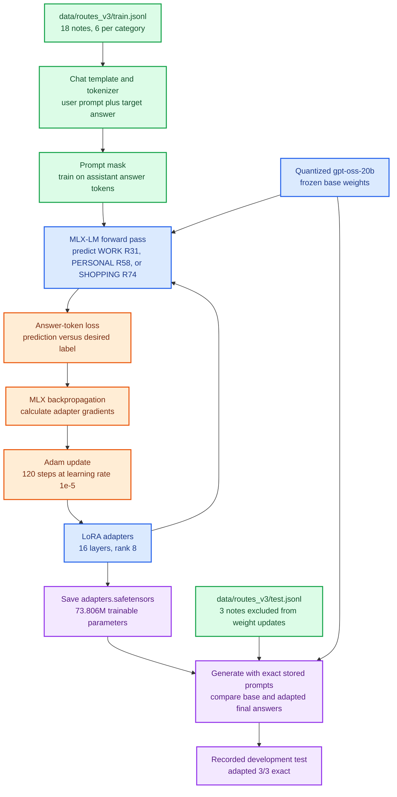
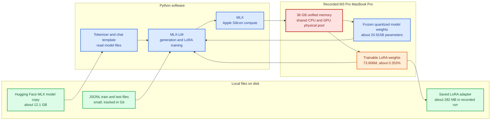

# Mermaid maps: gpt-oss-20b + MLX-LM

These diagrams use the actual route-code exercise. Green shows data preparation, blue shows the model and software, orange shows training updates, purple shows results, and red shows Mac hardware. The [experiment journal](experiments.md) has the commands and observed outputs.

## 1. Complete v3 training and evaluation path

The base model could identify a personal note in its analysis but did not produce a final route code within 256 tokens. The final adapter answered all three development test notes in the requested format. Those notes were checked during earlier attempts, so 3/3 is a learning result, not an independent generalization estimate.

## 2. Why the exercise required several runs

The v1 answer had nine supervised tokens, eight shared across all categories. V3 made both category and code vary in the compact answer. That is a plausible reason for improvement; this run did not isolate it from the smaller learning rate or longer training.

## 3. Software, files, and unified memory on the Mac

MLX uses Apple Silicon's shared physical memory pool. It still consumes memory for weights, adapters, activations, and other processes. The roughly 12.6 GB peak reported by **generation** is not a training-memory measurement. The 36 GB Mac is the tested configuration, not a proven minimum.
